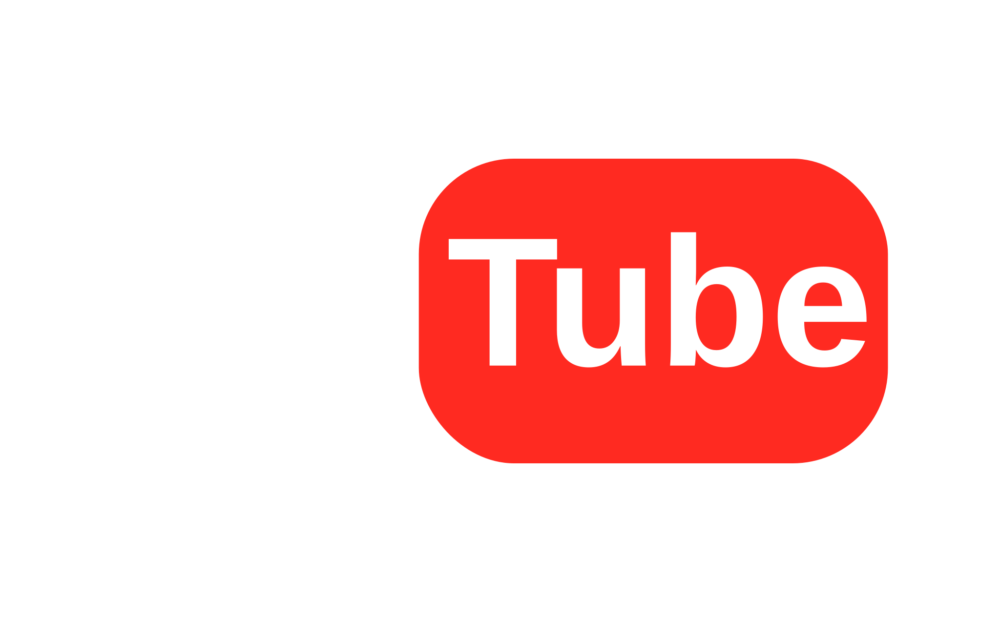
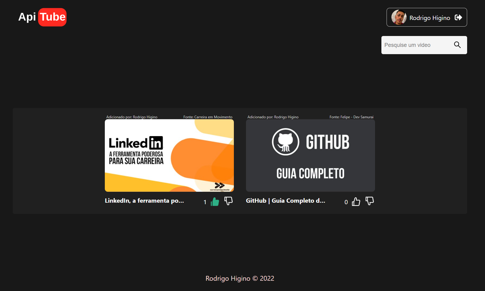

<h1 align="center">
  
</h1>

  <a href="#-tecnologias">Tecnologias</a>&nbsp;&nbsp;&nbsp;|&nbsp;&nbsp;&nbsp;
  <a href="#-projeto">Projeto</a>

 

  

## 🚀 Tecnologias

Esse projeto foi desenvolvido com as seguintes tecnologias:

- Typescript
- NextJs
- Redux
- Styled components
- Api do youtube
- Firebase authentication
- Firestore database
- Firebase hosting

## 💻 Projeto

Plataforma onde você pode criar ou entrar com o google e adicionar seus videos favoritos do youtube para compartilhar com seus amigos, com sistema de curtidas e filtrando os videos do mais curtido ao menos curtido.

---

Feito com ♥
